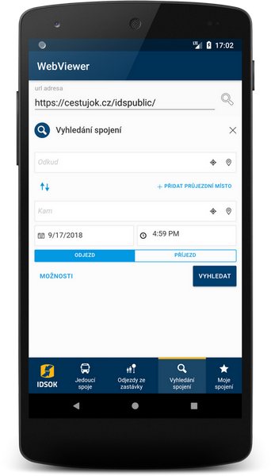

# AndroidWebViewer
Jednoduchá prohlížečka webových stránek v nativní Android komponentě WebView. Aplikace je určená pro testování integrace vlastních webových aplikací do nativních aplikací Android. Umožňuje snadno změnit vstupní parametry a zobrazuje URI, na kterou se obráceně web pokouší přesměrovat - což je nástroj komunikace WebView s okolní aplikací.

